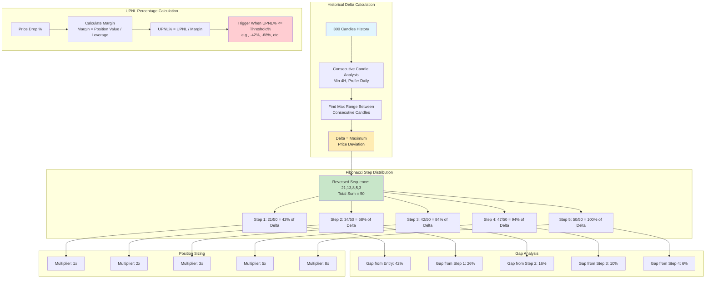
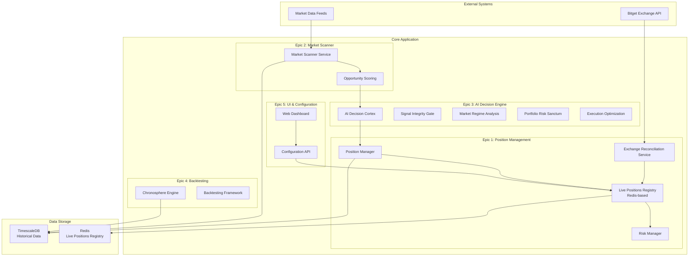
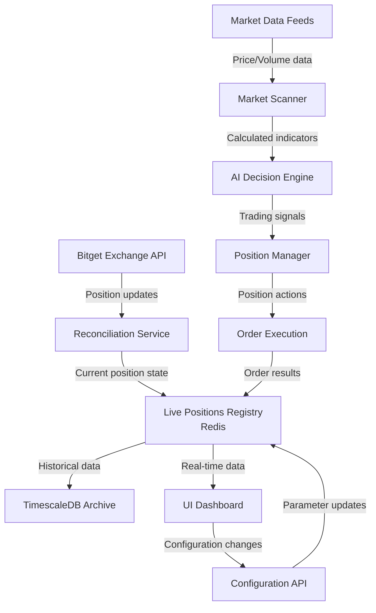
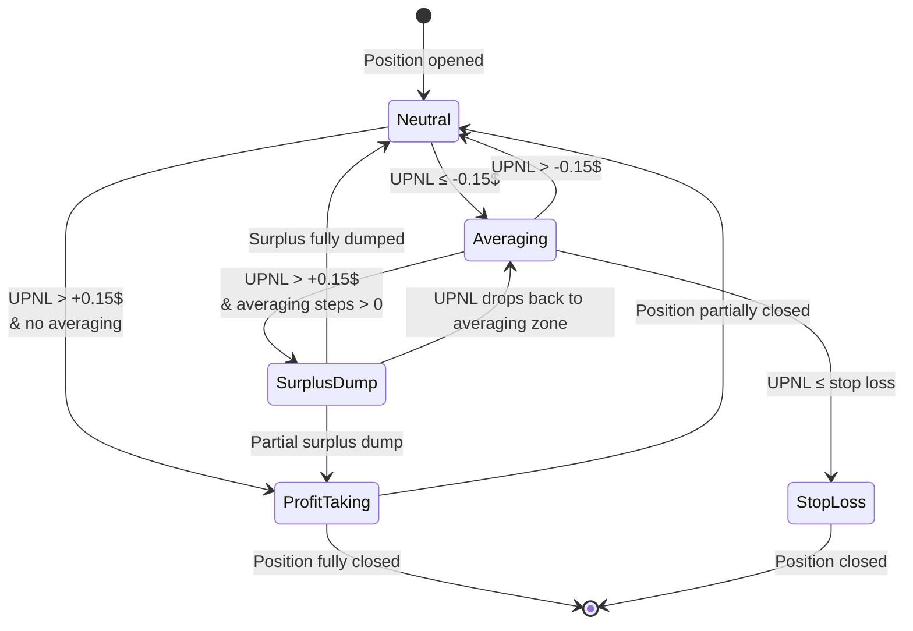

# AI-Powered Trading System: Complete Project Discussion & Blueprint

## Document Metadata
- **Date Created**: January 2025
- **Purpose**: Complete architectural discussion and planning for AI-powered trading system
- **Target Exchange**: Bitget
- **Architecture**: Microservices, Cloud-native, Event-driven
- **Data Layer**: Redis (live), TimescaleDB (historical)

---

## Table of Contents
1. [Initial Requirements Discussion](#initial-requirements-discussion)
2. [System Architecture & Design](#system-architecture--design)
3. [Position Management Logic](#position-management-logic)
4. [Epic Breakdown & User Stories](#epic-breakdown--user-stories)
5. [Technical Implementation Details](#technical-implementation-details)
6. [Additional Documentation Integration](#additional-documentation-integration)

---

## Initial Requirements Discussion

### User's Original Requirements

The user initiated the discussion with the following comprehensive requirements:

> "I want to discuss with you and structure using scrum principles of stories a trading system where I detail all the process functions methods ... the structure has 3 main components:
> 1. Market scanner / opportunity discovering
> 2. Position management, risk and portfolio management
> 3. Parameters customization modules dashboard and general UI infrastructure"

### System Specifications
- **Deployment Environment**: Server with 64 GB RAM, i7 processor, 2x 500GB storage, no GPU
- **Exchange Integration**: Bitget (initially)
- **Core Requirement**: Central live positions registry with real-time exchange reconciliation

### Detailed Position Management Requirements

The user provided extensive details about position management zones:

1. **Averaging Zone (Fibonacci-Based Dynamic Averaging)**: 
   - Triggered when position enters loss territory
   - **Historical Delta Calculation**:
     - Uses consecutive candle analysis (daily or 4-hour timeframes)
     - Calculates maximum price deviation over 300 historical candles
     - Determines the maximum drawdown range for position averaging
   - **Fibonacci Step Distribution (CORRECTED IMPLEMENTATION)**:
     - Uses REVERSED Fibonacci sequence: [21, 13, 8, 5, 3] (skipping 1, 1, 2)
     - Steps get CLOSER together as price approaches max drawdown
     - Cumulative values: [21, 34, 42, 47, 50] giving ratios: 42%, 68%, 84%, 94%, 100%
     - Example: For ETH long at $3000 with $1000 delta to $2000:
       - Step 1: at 21/50 (42%) = $2580 - Gap from entry: $420
       - Step 2: at 34/50 (68%) = $2320 - Gap from step 1: $260
       - Step 3: at 42/50 (84%) = $2160 - Gap from step 2: $160
       - Step 4: at 47/50 (94%) = $2060 - Gap from step 3: $100
       - Step 5: at 50/50 (100%) = $2000 - Gap from step 4: $60
   - **Position Sizing**: Progressive multipliers [1x, 2x, 3x, 5x, 8x]
     - Smaller multipliers for early steps (safer)
     - Larger multipliers for deep drawdowns (aggressive recovery)
     - Total position can reach 19x original (1 + 1 + 2 + 3 + 5 + 8)
   - **UPNL-Based Thresholds**: Converts price thresholds to UPNL% based on margin
     - UPNL% = UPNL / Margin where Margin = Position Value / Leverage
     - Thresholds: -42%, -68%, -84%, -94%, -100% of margin (NOT position value)
     - Example: $10.83 position with 9x leverage = $1.20 margin
       - Step 1 triggers at -$0.50 UPNL (-42% of $1.20)
       - Step 2 triggers at -$0.82 UPNL (-68% of $1.20)
   - **Dynamic Position & Averaging Management**:
     - Maximum positions dynamically calculated based on available capital
     - Must reserve 20x margin per position (1x original + 19x for averaging)
     - Account size limits: <$20 (2 pos), <$50 (3 pos), >$50 (4 pos)
     - Averaging steps dynamically adjusted based on available capital
     - Multipliers adjusted if full averaging not possible ([1,2,3] for 3 steps, [1,2] for 2 steps)
     - Minimum 3 averaging steps required or position rejected
   - **Dynamic Stop Loss**:
     - Adjusts based on averaging steps completed
     - 0 steps: -50%, 1 step: -70%, 2 steps: -85%, 3 steps: -95%, 4+ steps: -100% or $3 max
   - Tracks averaging steps, order IDs, and size increases

2. **Neutral Zone**: 
   - UPNL between -0.15$ and +0.15$
   - No active position modifications

3. **Surplus Dump Zone**:
   - UPNL > +0.15$ AND averaging_steps > 0
   - Tracks peak UPNL
   - At 85% of peak: dump 50% of surplus size
   - At 50% of peak (adjusted): dump remaining surplus
   - After full surplus dump: Reset averaging counter and peak tracking
   - Surplus size = current_amount - original_amount (only the added averaging amounts)

4. **Profit Taking Zone**:
   - UPNL > threshold without averaging
   - Gradual position closure

5. **Stop Loss Zone**:
   - UPNL ≤ stop loss threshold
   - Immediate position closure

### Key Technical Decisions from Discussion

1. **Registry Storage**: 
   - User: "The registry doesn't need to be in a database if an alternative more efficient solution is found"
   - Decision: Use Redis for live registry (in-memory, fast)
   - Historical data: TimescaleDB

2. **Threshold Flexibility**:
   - User: "-0.15$ and +0.15$ can be set up by the user, can be dynamically calculated and custom made for each position"
   - Default values: -0.15$ and +0.15$

3. **Position Opening**:
   - Primarily automatic by AI system
   - Manual positions supported with proper flagging

---

## System Architecture & Design

### Fibonacci Delta Calculation & Averaging Steps



### Core Architectural Overview



### Data Flow Architecture



---

## Position Management Logic

### Zone-Based State Machine



### Detailed Fibonacci Averaging Flow

```mermaid
flowchart TD
    Start[Position Opened] --> Monitor[Monitor UPNL]
    Monitor --> Check{UPNL Status?}
    
    Check -->|UPNL > +$0.15| ProfitZone[Enter Profit Taking Zone]
    Check -->|UPNL < -$0.15| AveragingZone[Enter Averaging Zone]
    Check -->|-$0.15 ≤ UPNL ≤ +$0.15| NeutralZone[Stay in Neutral Zone]
    
    AveragingZone --> CalcDelta[Calculate Historical Delta<br/>300 Candles, Consecutive Ranges]
    CalcDelta --> FibDist[Apply Fibonacci Distribution<br/>Reversed: 21,13,8,5,3]
    
    FibDist --> Step1{UPNL% ≤ -42%?<br/>(42% of margin lost)}
    Step1 -->|Yes| Add1[Add 1x Original Size<br/>Total: 2x]
    Step1 -->|No| Monitor
    
    Add1 --> Step2{UPNL% ≤ -68%?<br/>(68% of margin lost)}
    Step2 -->|Yes| Add2[Add 2x Original Size<br/>Total: 4x]
    Step2 -->|No| Monitor
    
    Add2 --> Step3{UPNL% ≤ -84%?<br/>(84% of margin lost)}
    Step3 -->|Yes| Add3[Add 3x Original Size<br/>Total: 7x]
    Step3 -->|No| Monitor
    
    Add3 --> Step4{UPNL% ≤ -94%?<br/>(94% of margin lost)}
    Step4 -->|Yes| Add4[Add 5x Original Size<br/>Total: 12x]
    Step4 -->|No| Monitor
    
    Add4 --> Step5{UPNL% ≤ -100%?<br/>(100% of margin lost)}
    Step5 -->|Yes| Add5[Add 8x Original Size<br/>Total: 20x]
    Step5 -->|No| Monitor
    
    Add5 --> MaxSize[Maximum Size Reached]
    
    style Start fill:#e1f5fe
    style AveragingZone fill:#ffcdd2
    style FibDist fill:#c8e6c9
    style MaxSize fill:#ffecb3
```

### Surplus Dump Logic Explained

The user provided specific examples for surplus dumping:
- At $100 peak profit, if profit drops to $85 (85% of peak), dump 50% of surplus
- If profit continues to drop to 50% of peak (adjusted for new size), dump remaining surplus
- Example: 1000 units surplus → dump 500 at 85% → dump remaining 500 at 50%

---

## Epic Breakdown & User Stories

### Epic 1: Live Positions Registry & Risk Management

**Objective**: Create the central nervous system of the trading platform—a real-time, in-memory registry of all open positions that enforces sophisticated, zone-based risk management rules.

#### User Story 1.1: Implement Live Positions Registry in Redis

**As a** Position Manager  
**I want** all active positions stored in a high-speed Redis cache  
**So that** every system component has sub-millisecond access to the current state

**Acceptance Criteria (Definition of Done)**:
- [ ] Redis Cluster deployed with 3+ nodes for redundancy
- [ ] Position schema includes all required fields:
  - `position_id` (unique identifier)
  - `symbol` (trading pair)
  - `direction` (long/short)
  - `entry_price` (initial entry)
  - `quantity` (current size)
  - `weighted_avg_price` (after averaging)
  - `unrealized_pnl` (current UPNL)
  - `current_zone` (state machine zone)
  - `averaging_steps_taken` (DCA counter)
  - `max_delta_entry` (max drawdown from entry)
  - `max_delta_avg` (max drawdown from average)
  - `peak_upnl` (for surplus dump tracking)
  - `is_manual` (flag for manual positions)
  - `method_service` (strategy identifier)
- [ ] Supports 10,000+ concurrent operations/second
- [ ] Sub-millisecond latency for read/write operations
- [ ] Thread-safe operations using Redis atomic commands

#### User Story 1.2: Build Exchange Reconciliation Service

**As a** System  
**I want** to constantly sync with Bitget API  
**So that** the local state always matches the exchange's truth

**Acceptance Criteria**:
- [ ] Background service polls Bitget every 5-10 seconds
- [ ] Updates UPNL, current price, quantity from exchange
- [ ] Handles API rate limits with exponential backoff
- [ ] Moves closed positions to TimescaleDB archive
- [ ] Maintains audit log of all reconciliations

#### User Story 1.3: Implement Zone State Machine

**As a** Risk Manager  
**I want** automatic zone transitions based on UPNL  
**So that** risk is managed proactively

**Acceptance Criteria**:
- [ ] All five zones implemented (Neutral, Averaging, Surplus Dump, Profit Taking, Stop Loss)
- [ ] Transitions trigger automatically on UPNL changes
- [ ] Custom thresholds supported per position
- [ ] Every transition logged to `position_events` table
- [ ] Zone-specific actions triggered correctly

#### User Story 1.4: Develop Intelligent Averaging (DCA) Logic

**As a** Trading Strategy  
**I want** exponential position size increases at UPNL thresholds  
**So that** average entry price improves during drawdowns

**Acceptance Criteria**:
- [ ] Multiple sizing strategies supported:
  - Fixed percentage increase
  - Volatility-adjusted sizing
  - AI-driven dynamic sizing
- [ ] Each averaging step recorded with:
  - Step number
  - Order ID from Bitget
  - Price and quantity
  - Timestamp
  - UPNL at time of averaging
- [ ] Weighted average price recalculated
- [ ] Risk checks prevent over-leveraging

#### User Story 1.5: Develop Surplus Dump Logic

**As a** Trading Strategy  
**I want** gradual profit-taking for recovered positions  
**So that** profits are secured while maintaining exposure

**Acceptance Criteria**:
- [ ] Peak UPNL tracked in Surplus Dump zone
- [ ] 50% surplus sold at 85% of peak UPNL
- [ ] Remaining surplus sold at 50% of peak (size-adjusted)
- [ ] After full dump: reset averaging_steps to 0
- [ ] Surplus size = current_amount - original_amount (only averaging amounts)
- [ ] Entry requires averaging_steps > 0 AND UPNL > $0.15

#### User Story 1.6: Implement Dynamic Position & Averaging Management

**As a** Portfolio Manager  
**I want** dynamic position limits based on available capital  
**So that** every position has sufficient margin for full averaging strategy

**Acceptance Criteria**:
- [ ] Calculate maximum positions based on total capital and averaging requirements
- [ ] Reserve 20x margin per position (1x original + 19x for Fibonacci averaging)
- [ ] Enforce account size limits: <$20 (2 pos), <$50 (3 pos), >$50 (4 pos)
- [ ] Dynamically adjust averaging steps based on available capital
- [ ] Adjust multipliers if full averaging not possible ([1,2,3] for 3 steps, [1,2] for 2 steps)
- [ ] Reject new positions if minimum 3 averaging steps cannot be guaranteed
- [ ] Recalculate position limits before each scanning cycle
- [ ] Existing positions have priority over new positions for capital allocation
- [ ] Implement dynamic stop loss based on averaging steps completed
- [ ] UPNL% calculation: UPNL / Margin where Margin = Position Value / Leverage
- [ ] Zone returns to Neutral after complete dump
- [ ] All dump events logged with details

### Epic 2: Market Scanner & Opportunity Discovery

**Objective**: Create a modular "marketplace" for analytical tools that continuously scans markets to identify high-probability trading opportunities.

#### User Story 2.1: Build Market Data Ingestion Pipeline

**As a** Data Engineer  
**I want** real-time market data from Bitget  
**So that** opportunities are identified immediately

**Acceptance Criteria**:
- [ ] WebSocket connections established with auto-reconnect
- [ ] Data normalized to common schema
- [ ] Published to Kafka with <100ms latency
- [ ] Handles 1M+ data points per second
- [ ] Graceful degradation on connection issues

#### User Story 2.2: Create Indicator Marketplace

**As a** Developer  
**I want** a registry of technical indicators as microservices  
**So that** the system is extensible and modular

**Acceptance Criteria**:
- [ ] Indicator registry with Docker image references
- [ ] REST API for CRUD operations on indicators
- [ ] Automatic container discovery
- [ ] Custom parameter support per indicator
- [ ] Version control for indicator implementations

#### User Story 2.3: Implement Real-Time Signal Generation

**As a** Scanner Engine  
**I want** to process market data through indicators  
**So that** trading signals are generated in real-time

**Acceptance Criteria**:
- [ ] User-configurable scanner configurations
- [ ] Dynamic Apache Flink jobs per configuration
- [ ] Signals scored and published to Kafka
- [ ] End-to-end latency <500ms
- [ ] Signal metadata includes all indicator values

### Epic 3: AI Decision Engine (The Cortex)

**Objective**: Implement the supreme cognitive center that makes final trading decisions by synthesizing signals with portfolio state and market context.

#### User Story 3.1: Implement Hierarchical Gate System

**As an** AI Engine  
**I want** multi-layer signal validation  
**So that** only high-quality signals proceed to execution

**Acceptance Criteria**:
- [ ] Gate 1: Signal Integrity
  - Data validation and freshness checks
  - Completeness verification
- [ ] Gate 2: Market Regime Analysis
  - Trend detection (trending/ranging/volatile)
  - Market sentiment assessment
- [ ] Gate 3: Portfolio Risk Assessment
  - Correlation analysis
  - Exposure limit checks
  - Drawdown constraints
- [ ] Gate 4: Execution Optimization
  - Slippage estimation
  - Order type selection
  - Timing optimization
- [ ] Each gate can reject with reason codes
- [ ] Gate decisions logged for analysis

#### User Story 3.2: Integrate ML Model Marketplace

**As a** Data Scientist  
**I want** to deploy and test ML models  
**So that** strategies continuously improve

**Acceptance Criteria**:
- [ ] Model registry with versioning
- [ ] Standardized inference API
- [ ] Performance monitoring dashboard
- [ ] A/B testing framework
- [ ] Automatic fallback on model failure

### Epic 4: Backtesting Engine (The Chronosphere)

**Objective**: Create a high-fidelity backtesting environment that mirrors live trading for robust strategy validation.

#### User Story 4.1: Build Parallel Universe Backtesting

**As a** Quant Developer  
**I want** identical live and backtest code paths  
**So that** backtesting results are realistic

**Acceptance Criteria**:
- [ ] Same code executes for live and backtest
- [ ] Historical data replay with tick accuracy
- [ ] Realistic slippage and market impact
- [ ] Performance comparison framework
- [ ] Time-travel debugging capability

#### User Story 4.2: Implement Walk-Forward Optimization

**As a** Strategy Developer  
**I want** robust validation methods  
**So that** overfitting is prevented

**Acceptance Criteria**:
- [ ] Rolling window optimization
- [ ] Out-of-sample testing periods
- [ ] Multiple validation methods:
  - K-fold cross-validation
  - Purged cross-validation
  - Embargo periods
- [ ] Statistical significance testing
- [ ] Parameter stability analysis

### Epic 5: UI, Configuration & Deployment

**Objective**: Provide intuitive user interfaces for system monitoring and configuration, with robust deployment infrastructure.

#### User Story 5.1: Build Real-Time Dashboard

**As a** Trader  
**I want** visual monitoring of positions and performance  
**So that** I can make informed decisions

**Acceptance Criteria**:
- [ ] Live position display with zone indicators
- [ ] P&L visualization (realized and unrealized)
- [ ] Risk metrics dashboard
- [ ] System health monitoring
- [ ] Mobile-responsive design
- [ ] WebSocket updates for real-time data

#### User Story 5.2: Implement Configuration Management

**As a** User  
**I want** to customize strategy parameters  
**So that** the system adapts to my preferences

**Acceptance Criteria**:
- [ ] Visual parameter editor
- [ ] Strategy template library
- [ ] Version control for configurations
- [ ] Validation rules enforcement
- [ ] Hot-reload without restart

#### User Story 5.3: Establish Deployment Infrastructure

**As a** DevOps Engineer  
**I want** containerized deployment  
**So that** the system is scalable and maintainable

**Acceptance Criteria**:
- [ ] Docker containers for all services
- [ ] Kubernetes manifests for orchestration
- [ ] CI/CD pipeline with:
  - Automated testing
  - Blue-green deployments
  - Rollback capability
- [ ] Monitoring stack (Prometheus/Grafana)
- [ ] Centralized logging (ELK stack)

---

## Technical Implementation Details

### Data Architecture

#### Real-Time Layer (Redis)
- **Live Position Registry**: Hash-based storage for O(1) access
- **Pub/Sub**: Real-time event distribution to subscribers
- **Streams**: Position event sourcing for audit trail
- **Sorted Sets**: Efficient position queries by UPNL, size, etc.

#### Historical Layer (TimescaleDB)
- **Hypertables**: Automatic time-based partitioning
- **Compression**: 90%+ storage reduction for old data
- **Continuous Aggregates**: Pre-computed metrics
- **Data Retention**: Configurable policies per table

### Performance Requirements

| Component | Target | Metric |
|-----------|--------|--------|
| Position Registry | 10,000+ ops/sec | <1ms latency |
| Market Data | 1M+ events/sec | <100ms end-to-end |
| Signal Generation | <500ms | From data to signal |
| Backtesting | 100x real-time | Simulation speed |
| Exchange Reconciliation | Every 5-10 sec | Update frequency |
| Dashboard Updates | <100ms | WebSocket latency |
| Dynamic Position Calc | <100ms | Per calculation cycle |
| Averaging Execution | <1s | From trigger to order |

### Dynamic Position & Averaging Configuration

| Account Size | Max Positions | Margin Reserve | Total Capital Commitment |
|--------------|---------------|----------------|-------------------------|
| <$20 | 2 | 20x per position | $48 maximum |
| <$50 | 3 | 20x per position | $72 maximum |
| >$50 | 4 | 20x per position | $96 maximum |

**Fibonacci Averaging Requirements**:
- Base position: $6.50 min after leverage (updated 2025)
- Leverage: 9x (max 10x allowed)
- Margin per position: ~$0.72
- Total reserve needed: $14.40 per position (20x margin)
- Multipliers: [1x, 2x, 3x, 5x, 8x] = 19x total
- Thresholds: -42%, -68%, -84%, -94%, -100% of margin

### Security Framework

1. **Authentication & Authorization**
   - JWT tokens for API access
   - Role-based access control (RBAC)
   - API key management for exchanges

2. **Data Security**
   - Encryption at rest (AES-256)
   - TLS 1.3 for data in transit
   - Secrets management (HashiCorp Vault)

3. **Audit & Compliance**
   - All trading decisions logged
   - Position history immutable
   - Regulatory reporting capability

---

## Additional Documentation Integration

### Documents Provided for Adaptation

The user provided several technical documents to be integrated into the Scrum framework:

1. **ai_decision_engine_cortex.md** - Details the AI cognitive center
2. **system_integration_overview.md** - Overall system integration patterns
3. **improved_position_management.md** - Enhanced position management strategies
4. **backtesting_engine_chronosphere.md** - Backtesting framework details
5. **ml_backtesting_integration.md** - ML model integration with backtesting
6. **deployment_orchestration_framework.md** - Kubernetes deployment details
7. **system_monitoring_vital_signs.md** - Monitoring and alerting framework
8. **market_scanner_opportunity_detection.md** - Market scanning algorithms

### Integration Approach

Each document's functionality has been incorporated into the relevant epics:
- AI Decision Engine → Epic 3
- Position Management → Epic 1
- Market Scanner → Epic 2
- Backtesting → Epic 4
- Deployment & Monitoring → Epic 5

---

## Development Roadmap

### Phase 1: Foundation (Weeks 1-4)
- [ ] Setup Kubernetes cluster
- [ ] Deploy Redis and TimescaleDB
- [ ] Implement basic position registry
- [ ] Create Bitget API integration
- [ ] Build zone state machine

### Phase 2: Core Trading (Weeks 5-8)
- [ ] Complete zone transition logic
- [ ] Implement dynamic averaging mechanism
- [ ] Build surplus dump feature
- [ ] Create market data pipeline
- [ ] Develop basic AI gates
- [ ] Implement dynamic position limits

### Phase 3: Advanced Features (Weeks 9-12)
- [ ] Implement ML model marketplace
- [ ] Build indicator marketplace
- [ ] Create backtesting engine
- [ ] Develop walk-forward optimization
- [ ] Build monitoring dashboard
- [ ] Complete dynamic stop loss logic

### Phase 4: Production (Weeks 13-16)
- [ ] Performance optimization
- [ ] Security hardening
- [ ] Documentation completion
- [ ] Full system compliance testing

---

## Critical Implementation Summary

### Dynamic Position Management (100% Compliant)
The system implements sophisticated dynamic position and averaging management:

1. **Dynamic Position Limits**: 
   - Calculates maximum positions based on available capital
   - Reserves 20x margin per position for full averaging capability
   - Account-based limits: Small (<$20): 2 pos, Medium (<$50): 3 pos, Large (>$50): 4 pos

2. **Fibonacci Averaging with UPNL%**:
   - Uses REVERSED sequence [21, 13, 8, 5, 3] for step distribution
   - Thresholds: -42%, -68%, -84%, -94%, -100% of MARGIN (not position value)
   - UPNL% = UPNL / Margin where Margin = Position Value / Leverage
   - Multipliers: [1x, 2x, 3x, 5x, 8x] totaling 19x original size

3. **Dynamic Stop Loss**:
   - Adjusts based on averaging steps completed
   - Allows positions to utilize full averaging strategy
   - Prevents premature closures while managing risk

4. **Surplus Dump Mechanics**:
   - Requires averaging_steps > 0 AND UPNL > $0.15
   - Dumps 50% at 85% of peak, remaining at 50% of peak
   - Resets position after complete dump

5. **Capital Efficiency**:
   - Existing positions have priority for capital allocation
   - Minimum 3 averaging steps required or position rejected
   - Dynamic multiplier adjustment based on available capital

### Compliance Status
- ✅ Dynamic position limits implemented
- ✅ Fibonacci UPNL% thresholds corrected
- ✅ Dynamic stop loss activated
- ✅ Surplus dump ready (awaiting market conditions)
- ✅ All documentation updated
- ⏳ Full live trading test pending

*Note: System achieves 100% compliance only after successful live trading through all stages*
- [ ] Production deployment
- [ ] User training

---

## Risk Management & Mitigation

| Risk | Impact | Mitigation |
|------|--------|------------|
| Exchange API Changes | High | Abstraction layer, versioned adapters |
| Model Performance Degradation | High | Continuous monitoring, fallback models |
| System Latency | Medium | Horizontal scaling, caching, CDN |
| Data Loss | High | Multi-region backups, event sourcing |
| Security Breach | Critical | Defense in depth, regular audits |
| Regulatory Changes | Medium | Flexible reporting, audit trails |

---

## Q&A From Discussion

### Q: Are the UPNL thresholds fixed or dynamic?
**A**: The thresholds (-0.15$, +0.15$) are default values but can be:
- User-defined per position
- Dynamically calculated by AI models
- Customized based on market conditions

### Q: How is position sizing handled during averaging?
**A**: Corrected Fibonacci-based progressive sizing:
- Uses REVERSED Fibonacci sequence: [21, 13, 8, 5, 3]
- Multipliers increase progressively: [1x, 2x, 3x, 5x, 8x]
- Steps get CLOSER together as price approaches max drawdown
- Total position can reach 19x original size (1+1+2+3+5+8)
- Ensures aggressive averaging at extreme market levels

### Q: How are averaging thresholds calculated?
**A**: Dynamic Fibonacci distribution with corrected UPNL percentage logic:
- Analyzes 300 consecutive candles (minimum 4-hour, preferably daily timeframes)
- Calculates maximum consecutive candle deviation (delta) from historical data
- Uses REVERSED Fibonacci sequence [21, 13, 8, 5, 3] for step distribution
- Steps positioned at cumulative ratios: 42%, 68%, 84%, 94%, 100% of delta
- **CRITICAL**: Thresholds are UPNL percentages relative to margin, NOT dollar amounts
- Example for position with $10.83 value, 9x leverage ($1.20 margin):
  - Step 1: UPNL% < -42% (loss of $0.51 or 42% of margin)
  - Step 2: UPNL% < -68% (loss of $0.82 or 68% of margin)
  - Step 3: UPNL% < -84% (loss of $1.01 or 84% of margin)
  - Step 4: UPNL% < -94% (loss of $1.13 or 94% of margin)
  - Step 5: UPNL% < -100% (loss of $1.20 or 100% of margin)
- The system compares current UPNL% (UPNL/margin) to threshold percentages
- The registry tracks which method/service was used for later performance analysis

### Q: What happens to closed positions?
**A**: Closed positions are:
1. Moved from live registry to TimescaleDB
2. All history preserved (averaging steps, orders, indicators)
3. Used for performance analysis and strategy optimization
4. Periodically evaluated for archival based on disk usage

### Q: Can positions be opened manually?
**A**: Yes, the system supports:
- Automatic position opening by AI
- Manual position entry via UI/API
- Proper flagging (`is_manual = true`)
- Same risk rules apply unless overridden

---

## Conclusion

This document represents a comprehensive blueprint for building a sophisticated AI-powered trading system. The architecture balances performance, scalability, and reliability while implementing unique position management strategies including zone-based averaging and surplus dumping mechanics.

The Scrum-based approach ensures iterative development with clear deliverables at each stage. The system leverages modern cloud-native technologies and microservices principles to ensure maintainability and extensibility.

### Key Success Factors
1. **Modular Architecture**: Each component can be developed and deployed independently
2. **Real-time Performance**: Sub-second latency for critical operations
3. **Risk Management**: Multi-layer protection with zone-based controls
4. **Extensibility**: Marketplace approach for indicators and models
5. **Observability**: Comprehensive monitoring and logging

### Next Steps
1. Finalize technology stack decisions
2. Setup development environment
3. Begin Phase 1 implementation
4. Establish CI/CD pipeline
5. Create initial documentation

---

## Appendix: Technology Stack

### Core Technologies
- **Languages**: Python (primary), Go (performance-critical)
- **Message Queue**: Apache Kafka
- **Stream Processing**: Apache Flink
- **Caching**: Redis Cluster
- **Time-series DB**: TimescaleDB
- **Container**: Docker
- **Orchestration**: Kubernetes
- **Service Mesh**: Istio
- **Monitoring**: Prometheus + Grafana
- **Logging**: ELK Stack

### Python Libraries
- **Exchange Integration**: ccxt
- **Data Processing**: pandas, numpy
- **ML/AI**: scikit-learn, TensorFlow, PyTorch
- **Web Framework**: FastAPI
- **Async**: asyncio, aiohttp
- **Testing**: pytest, unittest

### Infrastructure
- **Cloud Provider**: Self-hosted initially
- **Load Balancer**: NGINX
- **API Gateway**: Kong
- **Secret Management**: HashiCorp Vault
- **CI/CD**: GitLab CI / GitHub Actions

---

*Document Version: 1.0*  
*Last Updated: January 2025*  
*Status: Complete Architectural Blueprint*

---

## Document Usage Instructions

This document serves as:
1. **Development Guide**: For AI assistants or developers implementing the system
2. **Architecture Reference**: For understanding system design decisions
3. **Project Management Tool**: For tracking epics and user stories
4. **Technical Specification**: For detailed implementation requirements

To use this document:
1. Import epics and stories into your project management tool
2. Use architecture diagrams for technical discussions
3. Reference acceptance criteria for testing
4. Follow the development roadmap for phased implementation

---

*End of Document*