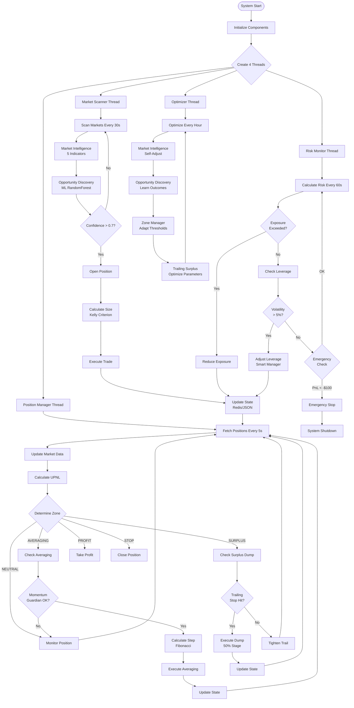
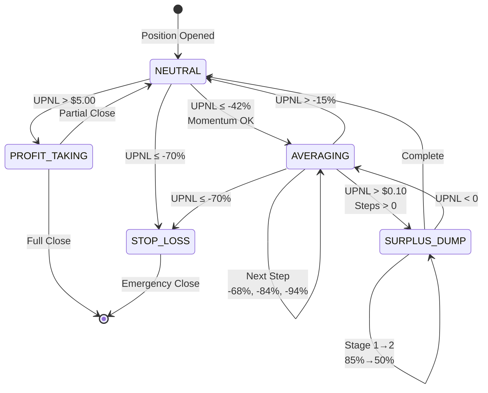
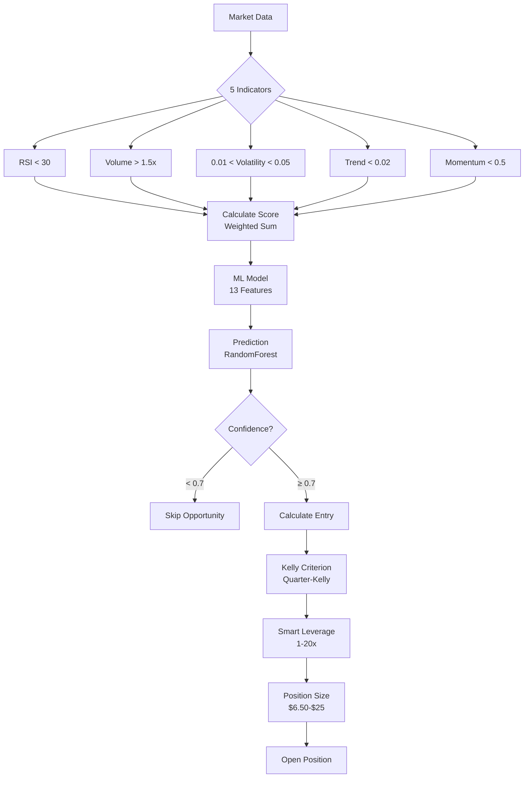
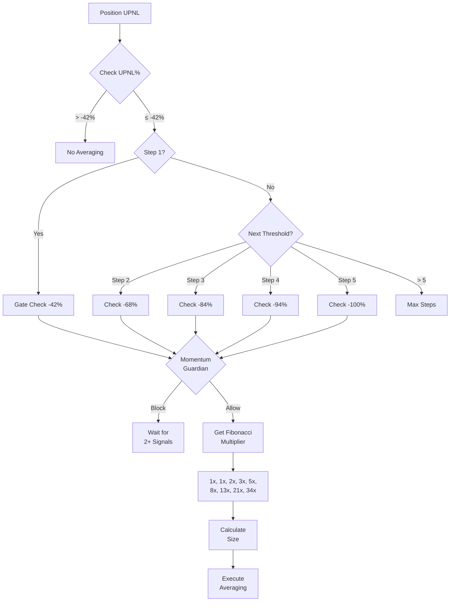
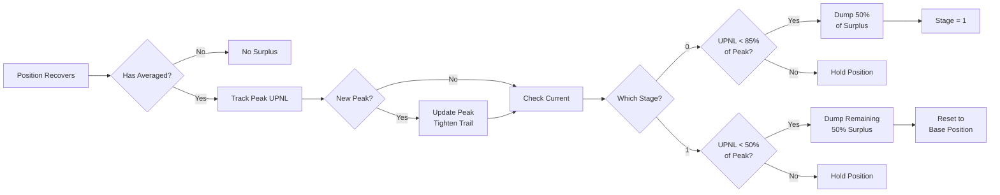
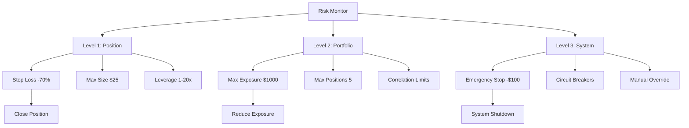
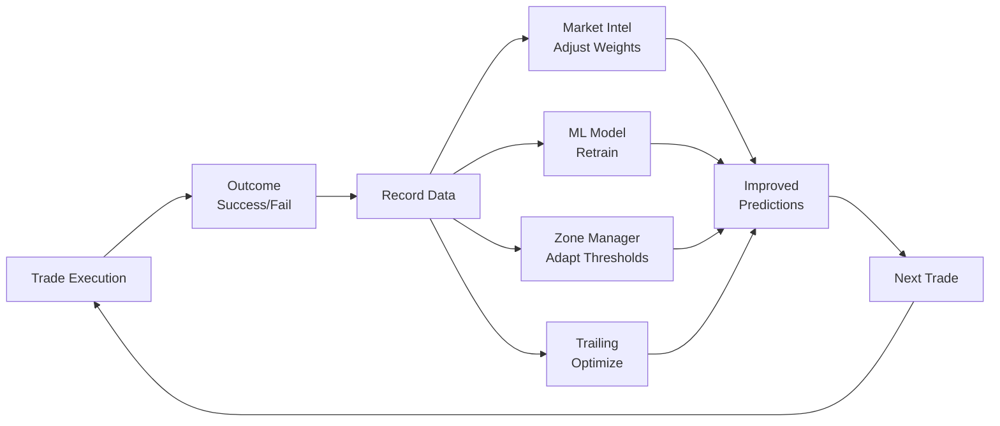

# AI-XYZ COMPLETE SYSTEM LOGIC FLOW DIAGRAM

## 🔄 MASTER FLOW DIAGRAM

## 📊 ZONE TRANSITION STATE MACHINE

## 🧠 DECISION FLOW - POSITION OPENING

## 💰 AVERAGING DECISION TREE

## 📈 SURPLUS DUMP FLOW

## 🛡️ RISK MANAGEMENT HIERARCHY

## 🔄 SELF-LEARNING FEEDBACK LOOP

## 📋 COMPONENT INTERACTION MATRIX

| Component | Reads From | Writes To | Frequency |
|-----------|------------|-----------|-----------|
| Market Scanner | Exchange API | Opportunity Queue | 30s |
| Opportunity Discovery | Market Data | Signal Queue | 30s |
| Position Manager | State Manager | Trade Queue | 5s |
| Zone Manager | Position State | Zone Events | On Change |
| Averaging Engine | Position State | Order Queue | On Trigger |
| Surplus Manager | Position State | Order Queue | On Trigger |
| Trailing Surplus | Peak Tracker | Order Queue | 5s |
| Risk Monitor | All Positions | Alert Queue | 60s |
| State Manager | All Components | Redis/JSON | Real-time |
| Optimizer | Performance DB | All Configs | 1 hour |

## 🎯 KEY DECISION POINTS

### 1. Position Entry
- Confidence > 0.7
- Volatility 1-5%
- Volume > 1.5x average
- Risk/Reward > 1.5

### 2. Averaging Entry
- UPNL ≤ -42% (first step)
- Momentum Guardian approval
- Fibonacci sizing
- Max 9 steps

### 3. Surplus Dump
- Must have averaged
- UPNL > $0.10
- 85% of peak → Dump 50%
- 50% of peak → Dump remaining

### 4. Emergency Exit
- Stop Loss: -70%
- System Loss: -$100
- Technical failure
- Manual override

## 🔐 SAFETY MECHANISMS

1. **Thread Safety**: Redis atomic operations
2. **Position Limits**: $6.50-$25 per position
3. **Exposure Limits**: $1000 total
4. **Leverage Limits**: 1-20x dynamic
5. **Emergency Stop**: -$100 total PnL
6. **Circuit Breakers**: Auto-pause on anomalies
7. **Fallback Mode**: JSON if Redis fails
8. **Audit Trail**: All decisions logged

---

*This complete logic flow represents the entire AI-XYZ Trading System v4.0 decision-making process*