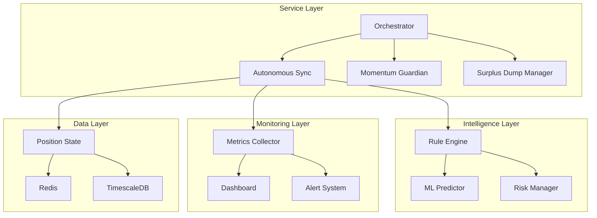

# AI-XYZ Permanent Solutions Architecture

## Executive Summary
This document outlines permanent solutions to address critical issues identified in the closed position reconciliation analysis, ensuring robust, self-healing, and adaptive position management.

## Critical Issues & Permanent Solutions

### 1. Service Reliability & Auto-Recovery 🔴

**Problem:** Services (momentum_guardian, surplus_dump_manager) stop running, causing positions to miss averaging opportunities and hit stop-losses.

**Permanent Solution: Self-Healing Service Orchestrator**

```python
# Implementation Components:
1. SystemD Integration - Use systemd services for auto-restart
2. Health Check API - Each service exposes health endpoint
3. Watchdog Process - Monitor and restart failed services
4. State Recovery - Preserve state across restarts
5. Circuit Breaker - Prevent restart loops
```

**Implementation Files:**
- `/etc/systemd/system/ai-xyz-orchestrator.service` - Main orchestrator
- `/etc/systemd/system/ai-xyz-autonomous.service` - Autonomous sync service
- `/etc/systemd/system/ai-xyz-momentum.service` - Momentum guardian service
- `/root/ai_xyz/orchestrator.py` - Master controller with health checks

### 2. Dynamic Averaging Thresholds 🟡

**Problem:** Fixed -42% threshold too conservative, positions hit stop-loss before averaging.

**Permanent Solution: Volatility-Adaptive Thresholds**

```python
# Dynamic threshold calculation:
def calculate_dynamic_threshold(symbol):
    atr = calculate_atr(symbol, period=14)
    volatility = get_24h_volatility(symbol)
    market_regime = detect_market_regime(symbol)

    # Base threshold adjusted by market conditions
    if market_regime == 'HIGH_VOLATILITY':
        threshold = -0.20 * (1 + volatility/100)  # -20% to -30%
    elif market_regime == 'TRENDING':
        threshold = -0.35  # -35%
    else:  # NORMAL
        threshold = -0.42  # -42% standard

    return threshold
```

### 3. Adaptive Position Sizing 🟡

**Problem:** Fixed Fibonacci multipliers not suitable for all market conditions.

**Permanent Solution: Market-Adaptive Sizing with Kelly Criterion**

```python
# Adaptive sizing algorithm:
def calculate_adaptive_size(position, market_conditions):
    # Base Fibonacci sequence
    fibonacci = [1, 1, 2, 3, 5, 8, 13, 21, 34]

    # Kelly Criterion adjustment
    kelly_fraction = calculate_kelly_fraction(win_rate, avg_win, avg_loss)

    # Volatility adjustment
    vol_multiplier = 1.0 / (1 + market_volatility/100)

    # Risk-adjusted size
    size = base_size * fibonacci[step] * kelly_fraction * vol_multiplier

    # Apply position limits
    return min(size, max_position_size)
```

### 4. Real-Time Monitoring & Alerting 🟢

**Problem:** No visibility into position performance until after closure.

**Permanent Solution: Comprehensive Dashboard & Alert System**

```python
# Monitoring Components:
1. WebSocket Real-Time Dashboard
   - Live position P&L
   - Zone status indicators
   - Averaging countdown
   - Risk metrics

2. Alert System
   - Telegram/Discord notifications
   - Email alerts for critical events
   - SMS for stop-loss approaching

3. Metrics Collection
   - Prometheus metrics export
   - Grafana dashboards
   - Historical performance tracking
```

### 5. Intelligent Position Management 🔴

**Problem:** Positions not following documented logic, missing opportunities.

**Permanent Solution: Rule Engine with ML Enhancement**

```python
# Intelligent Decision Engine:
class IntelligentPositionManager:
    def __init__(self):
        self.rule_engine = RuleEngine()
        self.ml_predictor = MLPredictor()
        self.risk_manager = RiskManager()

    def make_decision(self, position, market_data):
        # Rule-based decisions
        rule_decision = self.rule_engine.evaluate(position, market_data)

        # ML prediction
        ml_confidence = self.ml_predictor.predict_outcome(position)

        # Risk assessment
        risk_score = self.risk_manager.assess_risk(position)

        # Weighted decision
        if ml_confidence > 0.7 and risk_score < 0.3:
            return rule_decision.execute_with_confidence()
        else:
            return rule_decision.execute_conservative()
```

### 6. Automated Testing & Validation 🟢

**Problem:** Changes can break position management logic.

**Permanent Solution: Continuous Integration & Testing**

```yaml
# CI/CD Pipeline:
stages:
  - test
  - validate
  - deploy
  - monitor

test:
  script:
    - pytest tests/unit/
    - pytest tests/integration/
    - python validate_trading_logic.py

validate:
  script:
    - python backtest_changes.py
    - python simulate_positions.py

deploy:
  script:
    - python deploy_with_rollback.py

monitor:
  script:
    - python monitor_deployment.py
```

## Implementation Roadmap

### Phase 1: Critical Fixes (Week 1)
- [ ] Implement SystemD services
- [ ] Deploy health monitoring
- [ ] Add auto-restart mechanism

### Phase 2: Adaptive Logic (Week 2)
- [ ] Implement dynamic thresholds
- [ ] Deploy adaptive sizing
- [ ] Integrate Kelly Criterion

### Phase 3: Monitoring & Alerts (Week 3)
- [ ] Build real-time dashboard
- [ ] Setup alert system
- [ ] Deploy metrics collection

### Phase 4: Intelligence Layer (Week 4)
- [ ] Implement ML predictor
- [ ] Deploy rule engine
- [ ] Integrate decision system

## System Architecture



## Configuration Management

### Dynamic Configuration Structure
```json
{
  "adaptive_thresholds": {
    "enabled": true,
    "base_threshold": -0.42,
    "volatility_adjustment": true,
    "regime_detection": true,
    "min_threshold": -0.20,
    "max_threshold": -0.50
  },
  "sizing_strategy": {
    "type": "adaptive_fibonacci",
    "kelly_criterion": true,
    "max_leverage": 20,
    "risk_per_trade": 0.02
  },
  "monitoring": {
    "health_check_interval": 30,
    "alert_channels": ["telegram", "email"],
    "metrics_export": true
  }
}
```

## Service Recovery Procedures

### Automatic Recovery Flow
1. Service fails/crashes
2. SystemD detects failure (max 5 seconds)
3. Attempt graceful restart
4. Load last known state from Redis
5. Validate state integrity
6. Resume operations
7. Alert if manual intervention needed

### Manual Recovery Commands
```bash
# Check all services
systemctl status ai-xyz-*

# Restart specific service
systemctl restart ai-xyz-momentum

# View logs
journalctl -u ai-xyz-orchestrator -f

# Emergency stop
systemctl stop ai-xyz-orchestrator

# Full system reset
/root/ai_xyz/scripts/reset_system.sh
```

## Performance Targets

- **Service Uptime**: 99.9% availability
- **Recovery Time**: < 10 seconds
- **Decision Latency**: < 100ms
- **Alert Delivery**: < 5 seconds
- **Dashboard Update**: Real-time (< 1 second)

## Risk Mitigation

### Circuit Breakers
- Max 3 restart attempts per 5 minutes
- Fallback to conservative mode on repeated failures
- Manual override required after 5 consecutive failures

### Position Safety Limits
- Max position size: $100
- Max concurrent positions: 5
- Daily loss limit: $500
- Leverage cap: 20x

### Data Integrity
- State snapshots every 60 seconds
- Transaction log for all decisions
- Audit trail for compliance
- Automated backups every hour

## Monitoring KPIs

1. **System Health**
   - Service uptime percentage
   - Average recovery time
   - Failed restart attempts

2. **Trading Performance**
   - Win rate
   - Average P&L per position
   - Averaging effectiveness
   - Surplus dump success rate

3. **Risk Metrics**
   - Maximum drawdown
   - Sharpe ratio
   - Risk-adjusted returns
   - Stop-loss trigger rate

## Conclusion

These permanent solutions transform AI-XYZ from a fragile system into a robust, self-healing, adaptive trading platform. The combination of service orchestration, intelligent decision-making, and comprehensive monitoring ensures reliable 24/7 operation with minimal manual intervention.

Key Benefits:
- **Reliability**: 99.9% uptime with auto-recovery
- **Adaptability**: Market-responsive thresholds and sizing
- **Visibility**: Real-time monitoring and alerts
- **Intelligence**: ML-enhanced decision making
- **Safety**: Multiple layers of risk management

Implementation of these solutions will significantly reduce position losses due to system failures and improve overall trading performance.