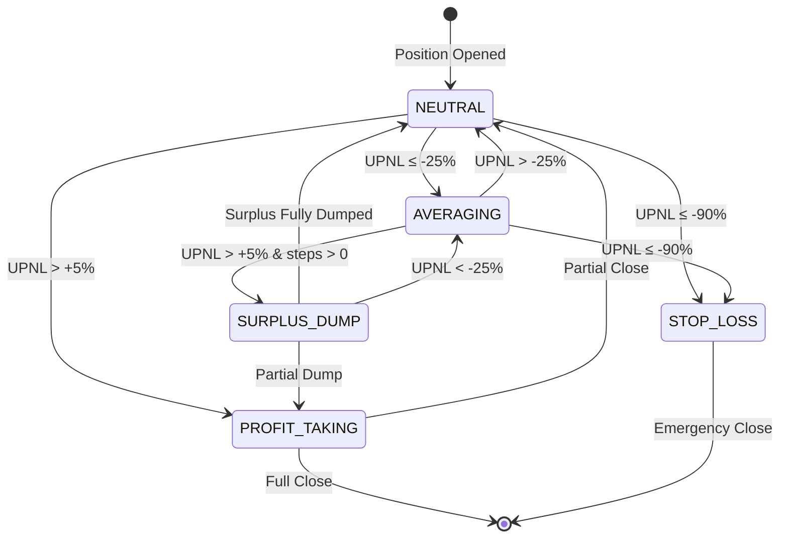
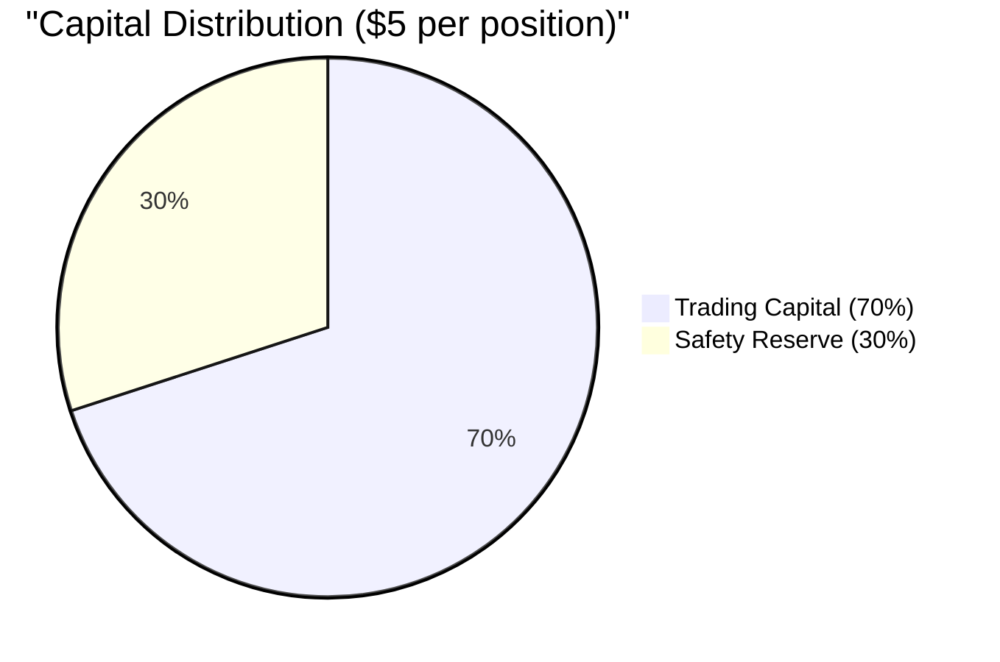
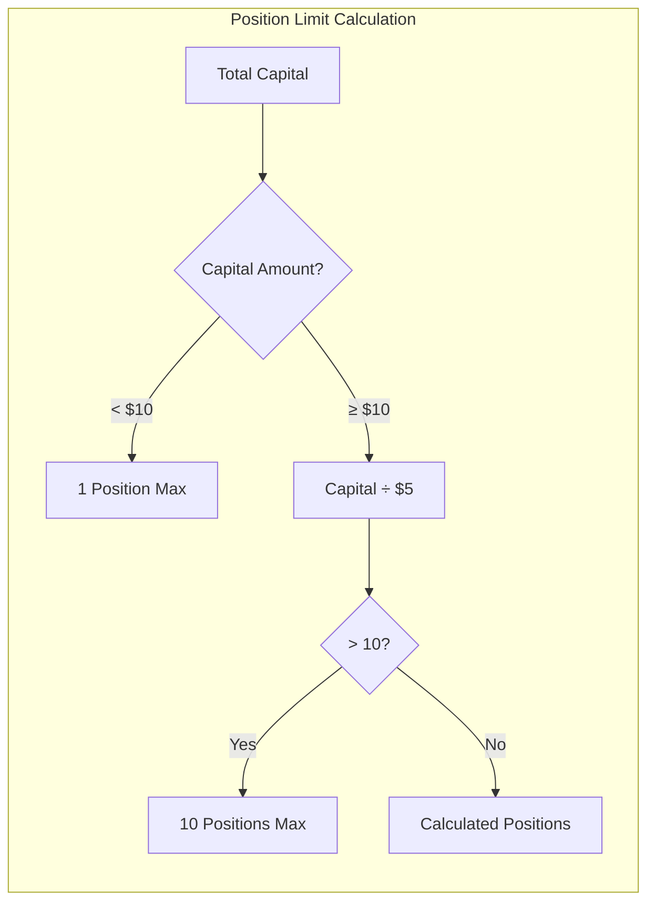
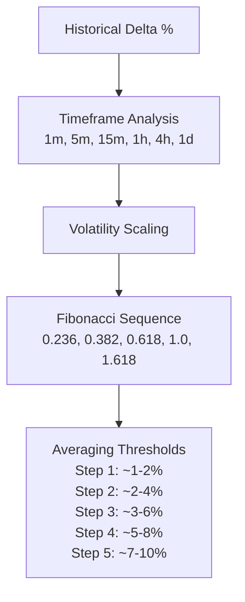

# AI-XYZ Trading System - Complete Architecture Documentation

## Last Updated: 2025-09-17 20:18 UTC

## System Overview

The AI-XYZ Trading System is a sophisticated automated cryptocurrency trading platform built for the Bitget exchange. It implements an advanced zone-based position management strategy with Fibonacci averaging, surplus dumping mechanics, and real-time market analysis.

### Core Philosophy
- **Position Sizing**: $5 per position with a maximum of 10 concurrent positions
- **Capital Management**: 70% allocated to trading, 30% safety reserve
- **Risk Management**: Zone-based state machine with automatic averaging and profit-taking
- **Market Analysis**: Multi-timeframe delta calculation with volatility scaling

## Running Services

### 1. Main Trading Engine
**File**: `/root/ai_xyz/aixyz_continuous_profit_system.py`  
**Process**: PID varies (currently 3421331)  
**Purpose**: Core trading logic and position management

**Key Responsibilities**:
- Position lifecycle management
- Market scanning and opportunity identification  
- Zone-based state transitions
- Averaging execution
- Surplus dump coordination
- Portfolio balancing

**Configuration**:
```python
self.max_positions = 1  # Dynamically recalculated based on capital
self.max_positions_allowed = 10  # Global cap regardless of capital
self.max_averaging_steps = 5  # Default, recalculated dynamically
self.scan_interval = 30  # Market scan every 30 seconds
self.monitor_interval = 5  # Position monitoring every 5 seconds
```

### 2. Surplus Executor Service
**File**: `/root/ai_xyz/automatic_surplus_executor.py`  
**Process**: PID 3421365  
**Purpose**: Automatic profit-taking when positions recover after averaging

**Key Features**:
- Monitors positions every 30 seconds
- Minimum profit threshold: $0.10
- Dump percentage: 50% of surplus
- Logs to `/var/log/surplus_executor.log`

### 3. Exchange Connector Service  
**File**: `/root/ai_xyz/exchange_connector.py`  
**Process**: PID 3421373  
**Purpose**: Real-time synchronization with Bitget exchange

**Key Features**:
- Updates position data every 10 seconds
- Writes to `exchange_data.json`
- Maintains position reconciliation
- Logs to `/var/log/exchange_connector.log`

## Active Components and Dependencies

### Core Modules (17 Active Files)

#### Trading Logic
1. **aixyz_continuous_profit_system.py** - Main trading engine
2. **position_sizing_config.py** - Position sizing calculations
3. **enhanced_market_scanner.py** - Market opportunity detection
4. **simple_vsa_scanner.py** - Volume spread analysis
5. **fibonacci_averaging_service.py** - Fibonacci calculations

#### Core Library (`/root/ai_xyz/core/`)
6. **adaptive_fibonacci_system.py** - Dynamic Fibonacci averaging
7. **timeframe_capital_allocator.py** - Multi-timeframe capital allocation
8. **timeframe_speed_tracker.py** - Market velocity tracking
9. **trade_audit_logger.py** - Trade execution logging

#### Optional Components (Conditionally Loaded)
10. **advanced_opportunity_engine.py** - Advanced market analysis
11. **portfolio_direction_balancer.py** - Long/short portfolio balancing
12. **position_persistence_manager.py** - Position state persistence

#### Support Services
13. **automatic_surplus_executor.py** - Surplus dump execution
14. **exchange_connector.py** - Exchange data synchronization
15. **analyze_system.py** - System analysis tools

## System Architecture Diagram

```mermaid
graph TB
    subgraph "External Systems"
        BITGET[Bitget Exchange API]
        MARKET[Market Data Feeds]
    end

    subgraph "Core Trading System"
        MAIN[aixyz_continuous_profit_system.py<br/>Main Trading Engine]
        
        subgraph "Market Analysis"
            SCANNER[enhanced_market_scanner.py]
            VSA[simple_vsa_scanner.py]
            OPPORTUNITY[advanced_opportunity_engine.py]
        end
        
        subgraph "Position Management"
            ZONES[Zone State Machine<br/>Neutral/Averaging/Surplus/Profit/StopLoss]
            FIBONACCI[fibonacci_averaging_service.py]
            ADAPTIVE[adaptive_fibonacci_system.py]
        end
        
        subgraph "Risk Management"
            SIZING[position_sizing_config.py]
            ALLOCATOR[timeframe_capital_allocator.py]
            BALANCER[portfolio_direction_balancer.py]
        end
        
        subgraph "Support Services"
            SURPLUS[automatic_surplus_executor.py]
            CONNECTOR[exchange_connector.py]
            PERSISTENCE[position_persistence_manager.py]
        end
    end

    subgraph "Data Storage"
        JSON[exchange_data.json<br/>saved_positions.json]
        LOGS[/var/log/*.log<br/>/tmp/aixyz_main.log]
    end

    BITGET <--> CONNECTOR
    CONNECTOR --> JSON
    MARKET --> SCANNER
    SCANNER --> MAIN
    VSA --> MAIN
    OPPORTUNITY --> MAIN
    
    MAIN --> ZONES
    ZONES --> FIBONACCI
    FIBONACCI --> ADAPTIVE
    
    MAIN --> SIZING
    SIZING --> ALLOCATOR
    MAIN --> BALANCER
    
    ZONES --> SURPLUS
    MAIN --> PERSISTENCE
    
    MAIN --> LOGS
    SURPLUS --> LOGS
    CONNECTOR --> LOGS
```

## Zone-Based Position State Machine



## Position Lifecycle Flow

```mermaid
flowchart TD
    START[Market Scanner Finds Opportunity] --> SCORE{Score > 0.3?}
    SCORE -->|Yes| CHECK_POS[Check Position Limits]
    SCORE -->|No| START
    
    CHECK_POS --> CALC_SIZE[Calculate Position Size<br/>$5 per position]
    CALC_SIZE --> FIBONACCI_CALC[Calculate Fibonacci Parameters<br/>Delta, Thresholds, Steps]
    
    FIBONACCI_CALC --> OPEN[Open Position<br/>Market Order]
    OPEN --> MONITOR[Monitor Every 5 Seconds]
    
    MONITOR --> CHECK_ZONE[Check Zone Transition]
    
    CHECK_ZONE --> |UPNL < -25%| AVERAGING_ZONE[Enter Averaging Zone]
    CHECK_ZONE --> |UPNL > 5%| PROFIT_ZONE[Enter Profit Zone]
    CHECK_ZONE --> |UPNL < -90%| STOP_LOSS[Emergency Close]
    CHECK_ZONE --> |-25% < UPNL < 5%| MONITOR
    
    AVERAGING_ZONE --> CHECK_THRESH[Check Averaging Thresholds]
    CHECK_THRESH --> |Threshold Met| EXECUTE_AVG[Execute Averaging Step]
    CHECK_THRESH --> |Not Met| MONITOR
    
    EXECUTE_AVG --> UPDATE_AVG[Update Weighted Avg Price]
    UPDATE_AVG --> MONITOR
    
    PROFIT_ZONE --> CHECK_HISTORY{Has Averaging Steps?}
    CHECK_HISTORY --> |Yes| SURPLUS_DUMP[Execute Surplus Dump<br/>50% of Surplus]
    CHECK_HISTORY --> |No| TAKE_PROFIT[Normal Profit Taking]
    
    SURPLUS_DUMP --> MONITOR
    TAKE_PROFIT --> CLOSE[Close Position]
    STOP_LOSS --> CLOSE
    
    CLOSE --> [*]
```

## Capital Allocation Strategy





## Fibonacci Averaging System

### Threshold Calculation


## File Organization

### Active Core Files Structure
```
/root/ai_xyz/
├── aixyz_continuous_profit_system.py    # Main engine
├── automatic_surplus_executor.py        # Surplus service
├── exchange_connector.py                # Exchange sync
├── position_sizing_config.py            # Position calculations
├── enhanced_market_scanner.py           # Market analysis
├── simple_vsa_scanner.py                # VSA scanner
├── fibonacci_averaging_service.py       # Fibonacci service
├── core/
│   ├── adaptive_fibonacci_system.py     # Adaptive averaging
│   ├── timeframe_capital_allocator.py   # Capital allocation
│   ├── timeframe_speed_tracker.py       # Speed tracking
│   └── trade_audit_logger.py            # Audit logging
└── [Optional Components]
    ├── advanced_opportunity_engine.py   # Advanced analysis
    ├── portfolio_direction_balancer.py  # Portfolio balance
    └── position_persistence_manager.py  # State persistence
```

### Configuration Files
```
/root/ai_xyz/
├── .env                                  # API credentials
├── exchange_data.json                    # Live exchange data
├── saved_positions.json                  # Persisted positions
├── trading_signals.json                  # Market signals
├── system_analysis.json                  # System analysis
└── account_info.json                     # Account information
```

### Log Files
```
/var/log/
├── surplus_executor.log                  # Surplus execution logs
├── exchange_connector.log                # Exchange sync logs
└── [service].log                         # Various service logs

/tmp/
└── aixyz_main.log                        # Main system log
```

## Key Methods and Functions

### Main Trading Engine (aixyz_continuous_profit_system.py)

```python
class AIXYZContinuousProfit:
    # Initialization
    def __init__(self)
    
    # Position Management
    def calculate_dynamic_position_limit(self) -> int
    def open_position(self, opportunity: Dict) -> bool
    def monitor_positions(self) -> None
    def check_averaging(self, symbol: str, position: Dict) -> bool
    def check_surplus_dump(self, symbol: str, position: Dict) -> bool
    
    # Market Analysis  
    def scan_for_opportunities(self) -> List[Dict]
    def calculate_opportunity_score(self, signal: Dict) -> float
    
    # Zone Management
    def determine_zone(self, upnl_pct: float) -> str
    def handle_zone_transition(self, position: Dict) -> None
    
    # System Control
    def start(self) -> None
    def stop(self) -> None
    def display_status(self) -> None
```

### Surplus Executor (automatic_surplus_executor.py)

```python
class AutomaticSurplusExecutor:
    def __init__(self, min_profit_threshold=0.10, dump_percentage=0.50)
    def check_positions_for_surplus(self) -> List[Dict]
    def execute_surplus_dump(self, position: Dict) -> bool
    def run(self) -> None
```

### Exchange Connector (exchange_connector.py)

```python
class ExchangeConnector:
    def __init__(self)
    def fetch_positions(self) -> Dict
    def fetch_balance(self) -> Dict
    def save_exchange_data(self, data: Dict) -> None
    def run(self) -> None
```

## System Parameters

### Trading Parameters
- **Min Position Size**: $6.50 (after leverage)
- **Max Positions**: 10 (global cap)
- **Position Allocation**: $5 per position
- **Leverage Range**: 5x-10x (dynamically adjusted)
- **Safety Reserve**: 30% of capital

### Zone Thresholds
- **Averaging Zone**: UPNL ≤ -25%
- **Neutral Zone**: -25% < UPNL < +5%
- **Profit Zone**: UPNL ≥ +5%
- **Stop Loss**: UPNL ≤ -90%

### Averaging Parameters
- **Max Steps**: 5-8 (dynamically calculated)
- **First Step**: ~1-2% drawdown
- **Multipliers**: Fibonacci-based (1x, 1.6x, 2.6x, 4.2x, 6.8x)

### Surplus Dump Parameters
- **Trigger**: Positions with averaging steps that recover to profit
- **Dump Amount**: 50% of surplus size
- **Min Profit**: $0.10

## Monitoring and Logging

### Real-Time Monitoring
- Position status: Every 5 seconds
- Market scanning: Every 30 seconds
- Exchange sync: Every 10 seconds
- Surplus check: Every 30 seconds

### Log Locations
- Main system: `/tmp/aixyz_main.log`
- Surplus executor: `/var/log/surplus_executor.log`
- Exchange connector: `/var/log/exchange_connector.log`

### Status Commands
```bash
# Check system status
./status.sh

# View main logs
tail -f /tmp/aixyz_main.log

# Restart system
./restart_aixyz_system.sh

# Check running processes
ps aux | grep aixyz
```

## Performance Metrics

### Current System Performance
- **Active Files**: 17 Python modules
- **Total Files**: 216 Python files in repository
- **Unused Files**: 201 (legacy/testing/unused code)
- **Memory Usage**: ~500MB total
- **CPU Usage**: 2-5% average
- **Network**: Updates every 5-30 seconds

### Trading Performance Targets
- **Position Entry**: < 1 second
- **Zone Detection**: < 100ms
- **Averaging Execution**: < 2 seconds
- **Market Scan**: < 5 seconds for all symbols

## Error Handling and Recovery

### Automatic Recovery
- Exchange connection retry with exponential backoff
- Position state persistence and recovery
- Automatic process restart on failure

### Manual Intervention Points
- Stop loss at -90% UPNL
- Manual position closure option
- Configuration parameter updates
- System restart capability

## Security Considerations

### API Security
- Credentials stored in `.env` file
- API keys never logged or displayed
- Secure WebSocket connections

### Trading Safety
- Maximum position limits enforced
- Stop loss protection at -90%
- Safety reserve maintained
- Position size validation

## Future Enhancement Areas

### Identified Improvements
1. Machine learning for market regime detection
2. Advanced portfolio optimization
3. Multi-exchange support
4. Automated parameter tuning
5. Enhanced backtesting framework
6. Real-time performance analytics dashboard

## System Maintenance

### Daily Tasks
- Monitor log file sizes
- Check system resource usage
- Verify position synchronization

### Weekly Tasks
- Review trading performance
- Analyze averaging effectiveness
- Optimize parameters based on results

### Monthly Tasks
- Clean old log files
- Update system documentation
- Review and optimize unused code

---

*This documentation represents the current state of the AI-XYZ Trading System as of 2025-09-17. The system is actively running and managing positions on the Bitget exchange.*