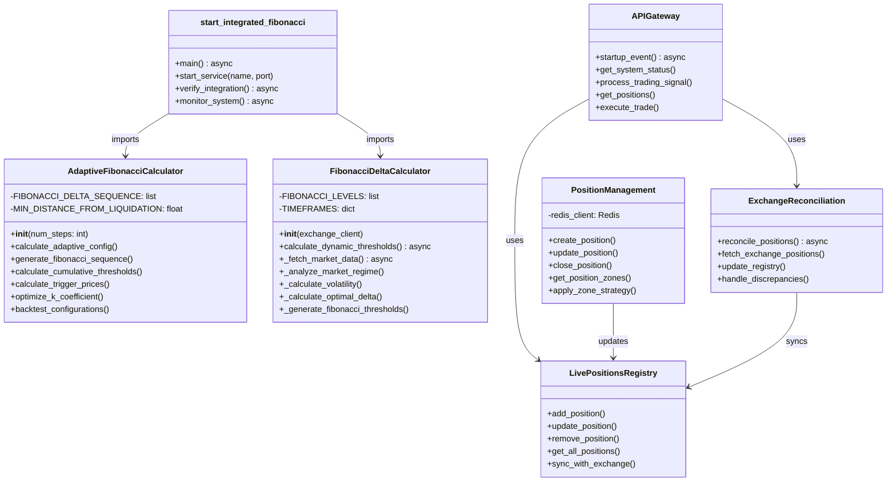
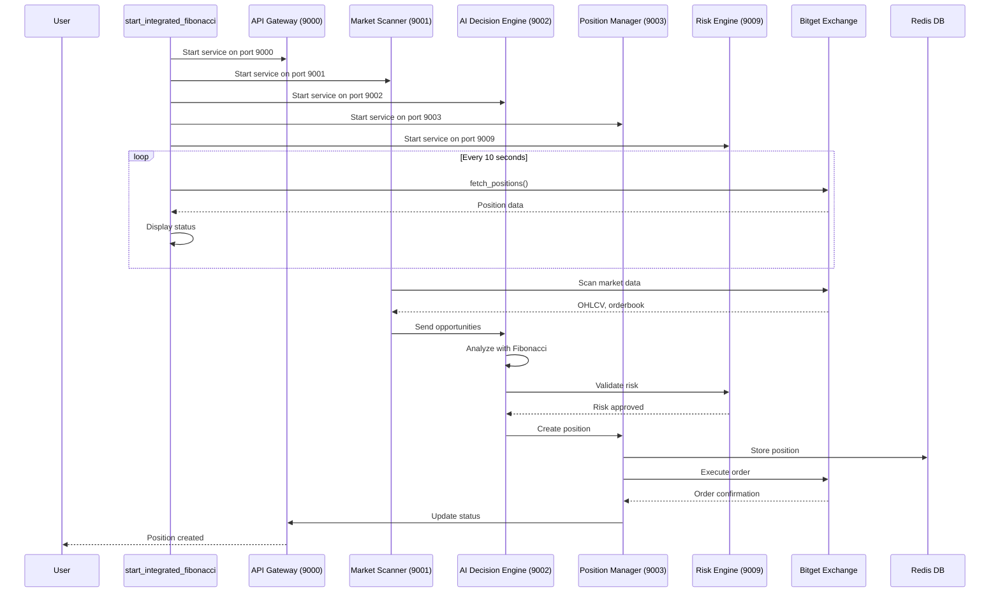
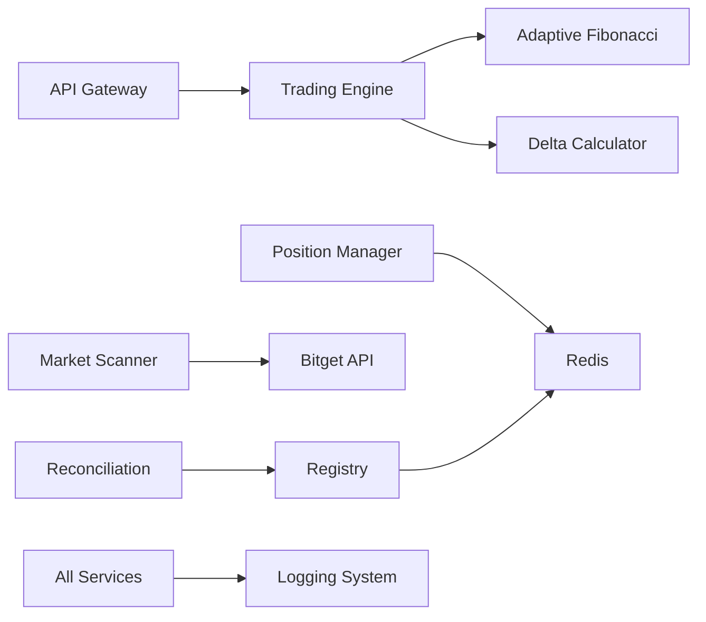

# AI-XYZ System Flow Analysis

Generated: 2025-09-16

## Currently Running Services

### Main Process
- **PID**: 1881540 (Running since Sep 14)
- **Entry File**: `/root/ai_xyz/start_integrated_fibonacci.py`
- **Status**: Active and monitoring positions

## System Architecture Flow

```mermaid
graph TB
    subgraph "Entry Point"
        START[start_integrated_fibonacci.py<br/>PID: 1881540]
    end

    subgraph "Core Modules"
        AFC[adaptive_fibonacci_averaging.py<br/>AdaptiveFibonacciCalculator]
        FDC[fibonacci_delta_calculator.py<br/>FibonacciDeltaCalculator]
    end

    subgraph "Microservices (Ports 9000-9009)"
        API[api-gateway/main.py<br/>Port: 9000]
        MS[market-scanner/main.py<br/>Port: 9001]
        ADE[ai-decision-engine/main.py<br/>Port: 9002]
        PM[position-management/main.py<br/>Port: 9003]
        RE[risk-engine/main.py<br/>Port: 9009]
    end

    subgraph "Data Layer"
        REDIS[(Redis<br/>DB: 3)]
        BITGET[Bitget Exchange API]
    end

    subgraph "Trading Components"
        FTE[futures_trading_engine.py]
        BFC[bitget_futures_client.py]
        LPR[live_positions_registry.py]
        ERS[exchange_reconciliation.py]
        PZM[position_zone_manager.py]
    end

    START -->|start_service()| API
    START -->|start_service()| MS
    START -->|start_service()| ADE
    START -->|start_service()| PM
    START -->|start_service()| RE
    START -->|monitor_system()| BITGET

    API -->|imports| FTE
    API -->|imports| BFC
    API -->|imports| LPR
    API -->|imports| ERS
    API -->|imports| PZM

    FTE -->|uses| AFC
    FTE -->|uses| FDC
    
    PM -->|stores| REDIS
    LPR -->|stores| REDIS
    
    BFC -->|fetches| BITGET
    ERS -->|reconciles| BITGET
    
    MS -->|scans| BITGET
    ADE -->|analyzes| MS
    RE -->|validates| PM
```

## Method and Function Flow



## Active Trading Flow



## Key Files and Their Roles

| File | Location | Purpose | Key Functions |
|------|----------|---------|---------------|
| start_integrated_fibonacci.py | /root/ai_xyz/ | Main entry point | main(), start_service(), monitor_system() |
| adaptive_fibonacci_averaging.py | /root/ai_xyz/core/ | Fibonacci averaging logic | calculate_adaptive_config(), optimize_k_coefficient() |
| fibonacci_delta_calculator.py | /root/ai_xyz/services/api-gateway/src/ | Delta calculation | calculate_dynamic_thresholds(), _analyze_market_regime() |
| main.py (API) | /root/ai_xyz/services/api-gateway/src/ | API Gateway | startup_event(), get_system_status() |
| main.py (PM) | /root/ai_xyz/services/position-management/src/ | Position management | create_position(), apply_zone_strategy() |
| live_positions_registry.py | /root/ai_xyz/services/api-gateway/src/ | Position registry | sync_with_exchange(), get_all_positions() |

## Current System Status

- **Main Process**: Running (PID 1881540)
- **Services Started**: 5 (API Gateway, Market Scanner, AI Decision Engine, Position Management, Risk Engine)
- **Ports Used**: 9000-9003, 9009
- **Database**: Redis DB 3
- **Exchange**: Bitget Futures API
- **Active Positions**: 5 (as per status check)
- **Balance**: $25.56 USDT

## Integration Points

1. **Fibonacci Integration**: 
   - FibonacciDeltaCalculator provides optimal delta
   - AdaptiveFibonacciCalculator distributes delta across steps
   - Both integrated into trading decisions

2. **Exchange Integration**:
   - Direct API connection to Bitget
   - Real-time position monitoring
   - Order execution and reconciliation

3. **Data Persistence**:
   - Redis for live position registry
   - In-memory caching for market data
   - Log files for audit trail

## Service Dependencies

